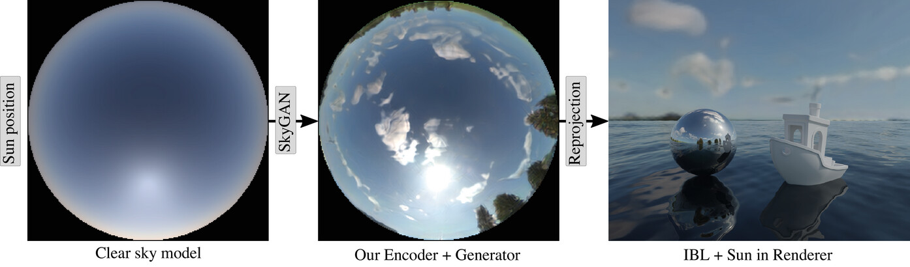

# SkyGAN Data Processing Pipeline

Automatized processing of fisheye HDR time lapse pictures, implemented for our paper [**SkyGAN: Realistic Cloud Imagery for Image-based Lighting**](https://doi.org/10.1111/cgf.14990).



*SkyGAN generates cloudy sky images from a user-chosen sun position that are readily usable as an environment map in any rendering system. We leverage an existing [clear sky model](https://cgg.mff.cuni.cz/publications/skymodel-2021/) to produce the input to our neural network which enhances the sky with clouds, haze and horizons learned from real photographs.*

This tool batch-processes one or more folders with time-lapse shooting sessions:
- sanity checks EXIF metadata in the RAW files (ensure a consecutive sequence of exposure stacks)
- merges all captured exposures using RawTherapee into 16-bit TIFF images (incl. denoising, debayering and chromatic aberration correction)
- generates PTGui project files, and runs PTGui to:
    - apply the inverse camera lens distortion and re-project each image to equirectangular ("latlong") and stereographic projection
    - store the results as EXR and JPEG files
- generates a preview video for each session

We also provide two stand-alone Jupyter notebooks in this repository to find the sun disk position and annotate the dataset to produce a CSV file for training our [SkyGAN network](https://github.com/CGGMFF/SkyGAN).

## Requirements
- Linux (developed on Debian 11)
- Python
- Docker
- PTGui (Pro?) license, can be purchased [here](https://ptgui.com/order.html)

## Install & usage
1. Build the Docker image with RawTherapee and PTGui (follow the `#!` instructions in `ext/docker-ptgui/Dockerfile`; if you don't see the file, run `git submodule update --init --recursive` to download the submoduled repo)
2. Install this tool by running `pip install --editable .` in the directory where you cloned this repository.
3. Modify filesystem paths (e.g. `/projects`) in the code to fit your environment.
4. Run it on one or more folders containing your captured RAW images:

```sh
$ skygan_data --help
Usage: skygan_data [OPTIONS] COMMAND [ARGS]...

Options:
  --help  Show this message and exit.

Commands:
  many
  one
```

5. Use the Jupyter notebooks (`solar_disk_interpolated_fit.ipynb` and `solar_disk_fit_viewer.ipynb`) to detect/fit the Sun position and generate the CSV with metadata needed for SkyGAN training.

## Testing
```sh
$ pip install tox
$ tox
```

## TODO
This is the up-to-date version we used for preparing the data for the training of our network. There are, however, some improvements and nice-to-haves still to be implemented:

 - [ ] Fix docker running under root vs. rootless
     - [ ] verify rootless is available
     - [ ] use rootless context under all machines
     - [ ] nice-to-have: ensure docker container is build in context
 - [ ] Convert RAW images with rawtherapee
     - [x] Denoising, Chromatic Abberation correction
     - [ ] Create [Lens Distortion Profile](https://helpx.adobe.com/camera-raw/digital-negative.html#Adobe_Lens_Profile_Creator) for our camera+lens
        - [ ] PTGUI Crop circle size from lens new camera calibration
     - [x] output to temporary 16-bit tiff
     - [x] temp folder in tmpfs `/run/user/$(id -u)/` $XDG_RUNTIME_DIR
 - [ ] Batch build projects for PTGui
     - [x] Cache EXIF timestamps per folder
     - [x] Group images by timestamp
     - [x] Replace images in template
       - [x] aperture/exposure metadata
       - [x] width/height
     - [x] Projection
     - [x] Replace GPS metadata
     - ~~[ ] Default file naming~~
     - [x] Output size / Resolution
     - [x] Lens settings
     - [ ] Check camera curve
     - [ ] Populate location from Google Sheet
     - [ ] Verify EXIF Orientation tag to be Horizontal
     - [x] Crop circle pos for 5D and 6D
     - [ ] nice-to-have: camera response curve optimized for our cameras
 - [ ] Export Panorama
     - [x] to 1k Stereographic up: EXR, JPG
     - [x] to 8k LatLong (Equirectangular): EXR, JPG
     - [x] skip when output exists
 - [ ] Provide masked images via Rustam's network
 - [ ] ~~nice-to-have: Parallelize over folders (`multiprocessing`), 2-3 workers~~
 - [x] Parallelize over multiple servers
     - [x] atomic creation of a file/dir to signalize it as "taken"
 - [ ] Validation
     - [x] Check with sun-disk detection notebook
     - [ ] automatize / new command for sun-disk detection
        - [ ] nice-to-have: optimize crop circle placement of PTGui across multiple datasets
        - [ ] nice-to-have: optimize non-levelness of tripod
     - [x] Debug color differences to previous manual exporting
        - stick with 5400 white balance over **ALL** datasets
        - stick with linear sensor response in PTGui
     - [x] Debug different exposures in old exporting for separate days
        - potentially some "autoboost" in old ptgui
        - we know camera curves were optimized differently / per image
        -> problem is PTGui choosing the "middle" image as 0EV, although we start with fixed bottom
        - [x] ~~write to PTGui, ask for a configuration option~~
        - [x] Debug 2019_06_05_1215_ronan
     - [ ] nice-to-have: Debug PTGui interpolator making a difference?
     - [/] Validate all images are not accidentally rotated
     - [ ] Validate all shootings by watching all videos
     - notes:
        - PTGui blend algorithm doesn't make a difference
 - [ ] Metadata
     - [x] Generate csv with sun position
     - [ ] Categorize skies into different bins of cloudyness
     - [x] Generate video
     - [ ] nice-to-have: overlay estimated sun position in videos


## Useful commnds
Rotate images to normal (horizontal) direction if they are not:
```sh
exiftool -Orientation=H -if '$orientation# != 1' .
```

Copy lens parameters from other image:
```sh
exiftool -tagsFromFile=<SOURCE_IMG> -FNumber -ApertureValue -FocalLength -LensType -MaxFocalLength -MinFocalLength -MaxAperture -MinAperture -TargetAperture -FocusDistanceLower -FocusDistanceUpper -LensModel -AFMicroadjustment -Lens -Aperture -LensID -Lens35efl -DOF -FOV -FocalLength35efl -HyperfocalDistance .
```
